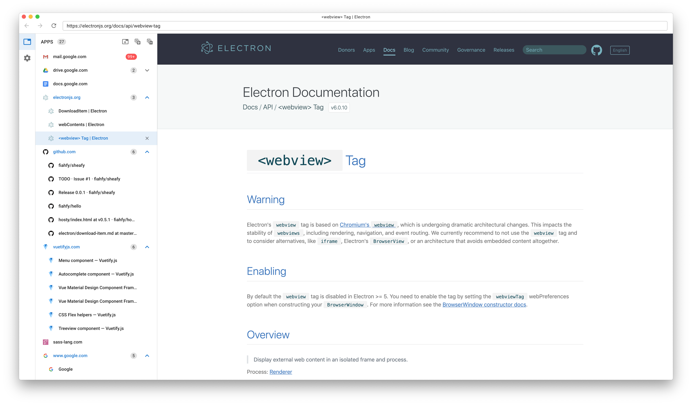

# 
[](https://travis-ci.com/fiahfy/picty)

> WIP


## Features
* 


## Screenshots



## Installation
1. Download the file for your platform from [releases page](https://github.com/fiahfy/picty/releases).
2. Open `.dmg` for OS X or run `.exe` for Windows.


## Development
``` bash
# install dependencies
yarn

# serve with hot reload
yarn dev
```
